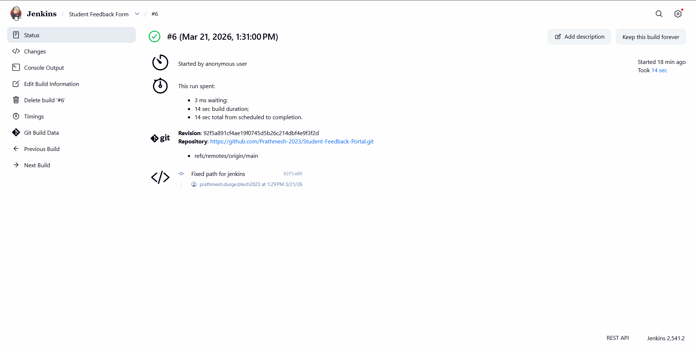

# 🎓 Student Feedback Form with Selenium Testing & Jenkins CI/CD

## 📌 Project Overview

This project demonstrates the development of a **Student Feedback Registration Form** using HTML, CSS, and JavaScript, along with **automated testing using Selenium** and **continuous integration using Jenkins**.

The system ensures that user inputs are validated and tested automatically whenever the project is executed.

---

## 🛠️ Technologies Used

* **HTML** – Structure of the form
* **CSS** – Styling and layout (Internal & External)
* **JavaScript** – Form validation
* **Python (Selenium)** – Automated testing
* **Jenkins** – Continuous Integration (CI/CD)

---

## 📋 Features of the Form

* Input fields:

  * Student Name
  * Email ID
  * Mobile Number
  * Department (Dropdown)
  * Gender (Radio buttons)
  * Feedback Comments
* Submit and Reset buttons
* User-friendly UI design

---

## ✅ Validation Rules (JavaScript)

* Name cannot be empty
* Email must be in valid format
* Mobile number must contain 10 digits
* Gender must be selected
* Department must be selected
* Feedback must contain at least 10 words

---

## 🤖 Selenium Test Cases

The following automated test cases are implemented:

1. Page load verification
2. Valid form submission
3. Empty field validation
4. Invalid email validation
5. Reset button functionality

---

## 🔄 Jenkins Integration (CI/CD)

Jenkins is used to automate the testing process:

* Fetches code from GitHub repository
* Installs required dependencies
* Executes Selenium test script
* Displays build status (SUCCESS / FAILURE)

---

## 📸 Jenkins Build Success



---

## 📂 Project Structure

```
Student-Feedback-Portal/
│── index.html
│── style.css
│── script.js
│── test_form.py
│── README.md
```

---

## 🚀 How to Run the Project

### 1. Clone the Repository

```
git clone https://github.com/your-username/Student-Feedback-Portal.git
```

### 2. Install Dependencies

```
pip install selenium
```

### 3. Run Selenium Test

```
python test_form.py
```

### 4. Run via Jenkins

* Create a Jenkins job
* Connect GitHub repository
* Add build step to run Python script
* Click **Build Now**

---

## 🎤 Conclusion

This project successfully demonstrates how web development, automation testing, and CI/CD tools can be integrated to create a reliable and efficient system.

---
